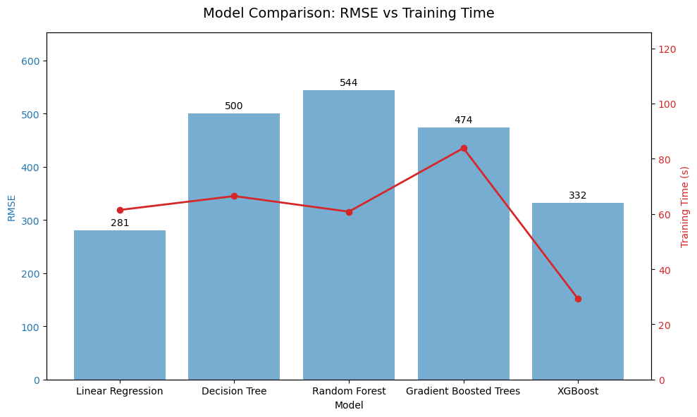
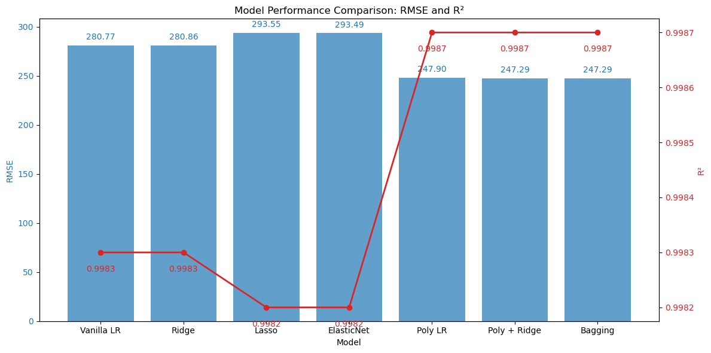

# A Large Scale Data-Driven Approach to Estimating Power Generation Costs in AC-OPF Problems
This project leverages large-scale OPFData to predict total power generation cost for AC Optimal Power Flow (AC-OPF) problems using machine learning (ML) techniques. The motivation is to create an efficient, scalable alternative to traditional optimization-based solvers for power systems.

We train models that take only **grid-level features**—representing the physical and operational constraints of a power system—as inputs, and output the **estimated total generation cost**. This approach eliminates the need for solving computationally expensive optimization problems while trying to retain predictive accuracy, especially in large-scale grid settings.
## Background

The Alternating Current Optimal Power Flow (AC-OPF) problem is a fundamental optimization task in power systems, aimed at determining the most cost-effective generation dispatch that meets demand while satisfying operational and physical grid constraints. Solving AC-OPF is computationally intensive, especially in large grids, due to its nonlinear and non-convex nature.

Traditionally, AC-OPF is solved using mathematical programming techniques that do not generalize across instances and require a full re-solve for every change in system conditions. This motivates data-driven approaches that can learn from past solutions to provide faster and scalable cost estimates.

## Problem Statement

Traditional AC-OPF solvers rely on nonlinear optimization techniques, which are often computationally intractable for large and complex power networks.

To address this, our project reframes AC-OPF cost estimation as a **supervised regression problem**. Given a dataset of solved OPF instances, we aim to:
- Learn a mapping from static grid features to total generation cost
- Reduce inference time compared to conventional solvers

## Data Sources and Description 
This project uses the [OPFData dataset](https://doi.org/10.48550/arXiv.2406.07234) [1], a large-scale collection of AC Optimal Power Flow (AC-OPF) problem instances with diverse grid configurations. The dataset is organized into three main components:

- **Grid** – Contains physical and operational parameters of the power system prior to optimization, including bus voltages, generator set points, loads, and transmission line data.
- **Solution** – Stores the post-optimization results, such as power generation levels after solving the OPF problem.
- **Metadata** – Includes the objective value, specifically the total generation cost in \$/h, derived from the OPF solution.

For this project, we focus exclusively on the **grid** and **metadata** components. By excluding the solution data, we ensure that our ML model predicts the total generation cost using only the input grid configuration, avoiding data leakage and improving generalization.

## Repository Structure
```
DS5460_FinalProject/
├── docs/                     # Supporting documentation and figures
├── Milestone1.ipynb          # Initial data exploration and preprocessing
├── Milestone2.ipynb          # More data exploration and cleaning 
├── Milestone3.ipynb          # Feature engineering and hyperparameter tuning
├── ModelComparison.ipynb     # Further model testing after Milestone3 (including XGBoost)
└── finalmilestone.ipynb      # Final model deployment and summary
```
## Installation Instructions

This project is designed to run entirely within a Google Cloud Dataproc environment. Follow the steps below to set up the dataset and run the notebooks.

### 1. Access and Prepare the Dataset

The dataset is hosted in a Google Cloud Storage bucket. To copy it into your own bucket for use in Dataproc:

- Follow the steps in [`docs/EXTRACTION_PROCESS.md`](docs/EXTRACTION_PROCESS.md) to retrieve and organize the dataset.
- Ensure your Google Cloud Storage bucket has appropriate permissions and structure to support access from your Dataproc cluster.

### 2. Launch a Dataproc Cluster (with XGBoost Support)

To support training with XGBoost via PySpark:

- You **must configure your cluster** to include the necessary XGBoost JAR files and dependencies.
- Follow the guide in [`docs/DOWNLOAD_XGBOOST.md`](docs/DOWNLOAD_XGBOOST.md) for step-by-step instructions on:
  - Uploading XGBoost JAR files to your bucket
  - Creating the appropriate initialization script
  - Launching a cluster with XGBoost compatibility

> ⚠️ Skipping this step may result in import or execution failures during XGBoost training.

### 3. Clone the Repository in Jupyter

Once your Dataproc cluster is live:

- Open the **Jupyter Notebook interface**
- Clone this repository directly from within a Jupyter terminal:

```bash
git clone https://github.com/atumlin/DS5460_FinalProject.git
```
### 4. Run the Notebooks
Notebooks are organized by milestone, representing different phases of the project.
- Milestone1.ipynb: Initial data ingestion and analysis 
- Milestone2.ipynb: Data exploration and cleaning
- Milestone3.ipynb: Feature engineering and early modeling
- ModelComparison.ipynb: Further model testing after Milestone 3 (including XGBoost)
- finalmilestone.ipynb: Final model results and summary

We recommend running the milestone notebooks sequentially for insight into the full process.

## Feature Engineering

This dataset is **synthetically generated**, which brought a few advantages and challenges:

- No missing or null values
- Many **constant-valued features** (e.g., `total_pg`, `avg_vg`, `num_loads`) that provided little to no value in modeling
- Initial model training using generator and line features showed these were mostly constant and not useful predictors.

### Correlation Analysis

We began by examining the **Pearson correlation** between available features and the total generation cost (`total_cost`).

| Feature                    | Correlation |
|----------------------------|-------------|
| `cost_per_mw`              | 1.0000      |
| `cost_per_gen`             | 1.0000      |
| `total_pd`                 | 0.9990      |
| `pd_per_load`              | 0.9990      |
| `load_to_gen_ratio`        | 0.9990      |
| `generation_margin`        | -0.9990     |
| `num_generators`           | 0.0104      |
| `trans_rate_a_sum`         | 0.0053      |
| `br_x_mean`                | 0.0026      |
| `avg_cost_squared`         | -0.0004     |
| `total_pg`                 | None (constant) |
| `avg_vg`                   | None (constant) |
| `avg_cost_linear`          | None (constant) |
| `avg_cost_offset`          | None (constant) |
| `num_loads`                | None (constant) |
| `br_r_mean`                | None (constant) |
| `rate_a_sum`               | None (constant) |
| `rate_b_min`               | None (constant) |
| `rate_c_max`               | None (constant) |
| `trans_br_r_mean`          | None (constant) |
| `trans_br_x_mean`          | None (constant) |
| `tap_mean`                 | None (constant) |
| `trans_to_br_ratio_r`      | None (constant) |
| `trans_to_br_ratio_x`      | None (constant) |
| `trans_rate_ratio`         | None (constant) |
| `load_per_generator`       | None (constant) |

We excluded features like `cost_per_mw` and `cost_per_gen` from modeling, as they directly encode cost-related values, which defeats the purpose of our predictive task. After removing those, we found that load-related features (e.g., `total_pd`, `pd_per_load`, `load_to_gen_ratio`) had the strongest correlations with `total_cost`. This aligns with intuition—power demand is a major driver of generation cost.

Meanwhile, many other features (e.g., generator specs, transmission line parameters) appeared as constants across the dataset. This is likely due to the way DeepMind structured the dataset: they varied load conditions while keeping grid topology and physical constraints unchanged across samples, which resulted in minimal variation in non-load features.

### Nuanced Feature Engineering

To improve learning generalizability and remove cost-related leakage, we **engineered a new set of features** from the initial load data (e.g., `pd`, `qd`) using PySpark:

- `pd_per_load`: Normalized active power per load node
- `std_pd`: Standard deviation of load across the grid
- `load_variability`: `std / avg` load — proxy for unevenness
- `load_range`: Max - Min load
- `load_skew`: `max / avg` — indicator of stress/imbalance
- `load_concentration`: `max / total` load — shows local dominance
- `reactive_ratio`: Total `qd / pd` — voltage control burden
- `load_to_gen_ratio`: Total load over total generation capacity
- `generation_margin`: Capacity buffer = gen - load

After feature selection, we kept the following high-impact variables:

| Final Feature             | Correlation with `total_cost` |
|---------------------------|-------------------------------|
| `load_to_gen_ratio`       | 0.9990                        |
| `avg_pd`                  | 0.9990                        |
| `pd_per_load`             | 0.9990                        |
| `std_pd`                  | 0.6223                        |
| `load_variability`        | 0.3792                        |
| `pd_range`, `load_range`, `max_pd` | ~0.2368             |
| `load_concentration`, `load_skew` | ~0.17               |
| `reactive_ratio`          | -0.6665                       |
| `generation_margin`       | -0.9990                       |

### Impact on Model Performance

Using these engineered features instead of raw load and grid attributes improved model performance.

- **Linear Regression RMSE (Before)**: 291.48  
- **Linear Regression RMSE (After)**: 277.19  
- **Improvement**: ~5% reduction in RMSE

These results highlight the value of **domain-informed feature engineering**, even when starting with synthetic, well-structured data.

## Modeling Approach

This project used an ML pipeline in PySpark to model the relationship between grid-level features and the total generation cost (`total_cost`).

### Data Preparation

- The final dataset, `combined_features_df`, was read directly from our GCS bucket after being saved as a parquet from our feature engineering steps.
- Our target variable (`label`) was `total_cost`, and the model inputs were the engineered grid features (primarily focused on load).
- All features were standardized using `StandardScaler` (zero mean, unit variance) to ensure comparability across scales.

### Baseline and Tree-Based Models

We initially evaluated four core models using PySpark ML Pipelines:

- **Linear Regression**
- **Decision Tree Regressor**
- **Random Forest Regressor**
- **Gradient Boosted Trees (GBT)**

Each model was trained on an 80/20 train-test split and evaluated using the following metrics:

- **RMSE (Root Mean Squared Error)**
- **MAE (Mean Absolute Error)**
- **R² (Coefficient of Determination)**
- **Training Time**

### Advanced Model: XGBoost in Spark

To further improve performance, we deployed **XGBoost** using `xgboost4j-spark`. This required:

- Launching a custom Dataproc cluster with XGBoost dependencies (instructions in [`docs/DOWNLOAD_XGBOOST.md`](docs/DOWNLOAD_XGBOOST.md))
- Using `SparkXGBRegressor` to train a boosted tree model
- Performing hyperparameter tuning via `TrainValidationSplit`, optimizing over:
  - `max_depth`
  - `learning_rate`
  - `n_estimators`
- Evaluating the best model on the full test set

### Key Finding

Despite the added complexity of tree-based and boosted models, **Linear Regression consistently performed best**, yielding the lowest RMSE. This aligns with the strong linear relationship observed between load features and cost.

### Model Performance Summary



This figure shows RMSE (bar) and training time (line) for each model. XGBoost offered competitive results especially in training time, but linear regression remained the most accurate under our feature constraints.

You can find training and evaluation scripts in [`ModelComparison.ipynb`]( ModelComparison.ipynb))

## Final Results and Model

To find the overall best performance among different adapted linear regression models, we evaluated seven core models using PySpark ML Pipelines:

- **Vanilla Linear Regression**
- **Lasso Regression (L1 Regularization)**
- **Ridge Regression (L2 Regularization)**
- **Elastic Net Regression (L1 + L2 Regularization)**
- **Linear Regression with Polynomial Feature Expansion**
- **Ridge Regression with Polynomial Feature Expansion**
- **Bagging Ensemble of Linear Regression Models** 



Our dataset exhibits strong linear correlations, making linear regression a highly effective modeling choice compared other modeling methods we tried. 

However, performance was further enhanced by incorporating polynomial feature expansion and bagging, both of which achieved the highest accuracy. Among them, polynomial feature expansion proved to be the most effective overall, offering the best trade-off between predictive performance, computational efficiency, and implementation cost. It allowed us to capture subtle nonlinear interactions while preserving model simplicity and interpretability.

## Resources 
> S. Lovett et al., “OPFData: Large-scale datasets for AC optimal power flow with topological perturbations,” arXiv preprint arXiv:2406.07234, Jun. 2024. https://doi.org/10.48550/arXiv.2406.07234
