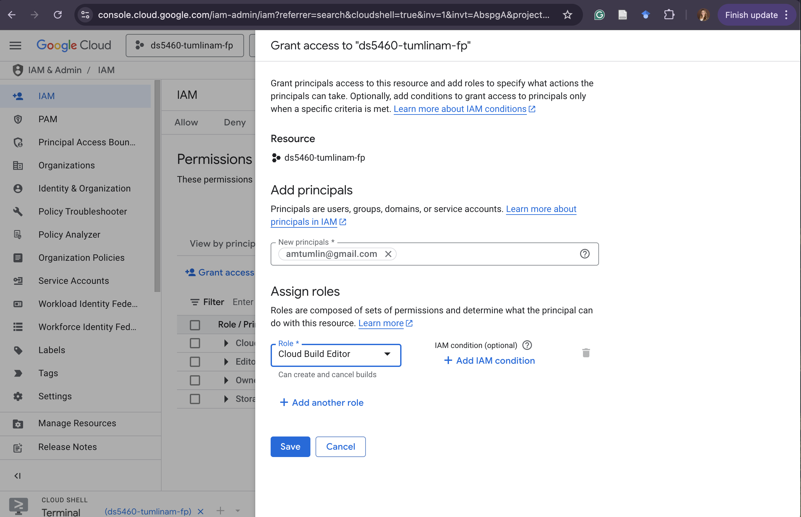

# DS5460 Milestone 2 - Data Extraction Process 

*The steps for getting the file from the original GCS bucket to our local GCS bucket.*

**Author: Anne Tumlin**

**Date: 03/21/25**

**NOTE:** We will watch the price of holding and storing this data in the GCS bucket, but I would recommend not doing this process multiple times (as it still takes a while). Therefore, when deleting the cluster, do not delete the storage bucket containing our transported data.

**Previous Issue:** The issue with the previous ingesting method was that we were trying to do it via the Jupyter notebook and reaching local storage capacity limits. Instead, we need to directly take the tar.gz file from the original GCS bucket and put it into our local GCS bucket. We can do this via the Cloud Shell command line and utilizing Cloud Build. Additionally, the dataset that we were utilizing before was 9GB compressed but 96GB uncompressed. Therefore, we are going to look at using a different dataset. Specifically, we will look at `gs://gridopt-dataset/dataset_release_1/pglib_opf_case500_goc_1.tar.gz`.

This is from my first attempt at doing this with the file `gs://gridopt-dataset/dataset_release_1/pglib_opf_case4661_sdet_1.tar.gz`. Here we can see that the true size of the file is 96.7 GB and I was reaching around an hour of extraction before timing out. 

```bash 
ERROR: context deadline exceeded
/ [12.1k/15.0k files][ 79.5 GiB/ 96.7 GiB]  82% Done  29.7 MiB/s ETA 00:09:53   
--------------------------------------------------------------------------------
Your build timed out. Use the [--timeout=DURATION] flag to change the timeout threshold.
ERROR: (gcloud.builds.submit) build 6e8bf48d-3fa2-4596-befc-d5ac01d6ebdf completed with status "TIMEOUT"
```

---

## Step 1. Set Up Your Working Directory and Cloud Build Configuration

Open up the Cloud Shell and create a new directory for the build files:


```bash
mkdir extraction-job
cd extraction-job
```

Create a new file called `cloudbuild.yaml`.
```bash
nano cloudbuild.yaml
```

Paste the following content into the file: 
```bash 
steps:
- name: 'gcr.io/google.com/cloudsdktool/cloud-sdk'
  entrypoint: 'bash'
  args:
    - '-c'
    - |
      # Download the tar.gz file from the source bucket
      gsutil cp gs://gridopt-dataset/dataset_release_1/pglib_opf_case500_goc_1.tar.gz .
      # Extract the tarball
      tar -xzvf pglib_opf_case500_goc_1.tar.gz
      # Upload all extracted files to the destination bucket
      gsutil -m cp -r . gs://ds5460-tumlinam-fp-bucket
```
Save and exit the nano editor *(Ctrl-X,Y,Enter)*.

---

## Step 2. Submit Your Cloud Build Job

Run the following command in the Google Cloud Shell:
```bash
gcloud builds submit --config cloudbuild.yaml .
```
This will start the build process of getting the files and copying them to your GCS bucket. [This process will take a while even with the smaller (but still large) dataset.]

### Troubleshooting 
You may experience some errors with user access to run build commands. If so, got to IAM & Admin. 

Click the grant access button. Add yourself as the new principal (whatever email you used to create your google cloud account) and then assign the role of cloud build editor. Click Save. 


---

## Step 3. Let the Build Run
This will take quite a while to extract all JSONs and copy them to the bucket. But hopefully, we will only have to do this once. Now, in our Jupyter notebook we should be able to directly upload them from GCS bucket without causing the local storage issues. 
```bash
- [15.0k/15.0k files][ 12.2 GiB/ 12.2 GiB] 100% Done  10.2 MiB/s ETA 00:00:00   
Operation completed over 15.0k objects/12.2 GiB.
PUSH
DONE
---------------------------------------------------------------------------------------------------------------------
ID: f75a329e-bd44-4c6f-916f-4ed8aa7b89ed
CREATE_TIME: 2025-03-21T20:13:27+00:00
DURATION: 21M4S
SOURCE: gs://ds5460-tumlinam-fp_cloudbuild/source/1742588006.918478-4b74845ae9f645eb9c4a6c3f1bae0187.tgz
IMAGES: -
STATUS: SUCCESS
```
You should get a final output message like this saying job success. We can see that we are now working with 12.2GB worth of data. 